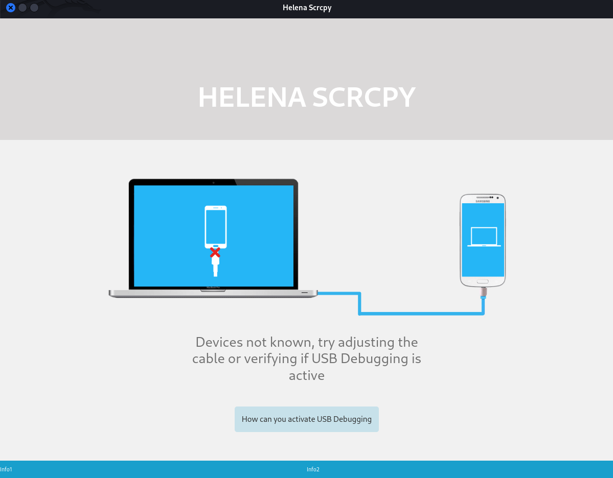

# Helena Scrcpy

TITLE: 
cell phone control system using usb or wifi

AUTHOR:
mr.Body (Walter Santana)

Website: https://mrbody.web.app/

**This GitHub repository (<https://github.com/mr-body/Helena-Scrcpy>) is based on Genymobile's scrcpy, with a more entertaining graphical performance for slightly more inexperienced users`scrcpy`.**

# Projecto Helena (v0.2)

_pronounced "**scr**een **c**o**py**"_

This application mirrors Android devices (video and audio) connected via
USB or [over TCP/IP](doc/connection.md#tcpip-wireless), and allows to control the
device with the keyboard and the mouse of the computer. It does not require any
_root_ access. It works on _Linux_, _Windows_ and _macOS_.

It focuses on:

 - **lightness**: native, displays only the device screen
 - **performance**: 30~120fps, depending on the device
 - **quality**: 1920×1080 or above
 - **low latency**: [35~70ms][lowlatency]
 - **low startup time**: ~1 second to display the first image
 - **non-intrusiveness**: nothing is left installed on the Android device
 - **user benefits**: no account, no ads, no internet required
 - **freedom**: free and open source software

[original]: https://github.com/Genymobile/scrcpy

CREDITS:

Bootstrap
http://getbootstrap.com/

jQuery
http://jquery.com/

python Eel
https://github.com/python-eel/Eel

reactjs
https://pt-br.legacy.reactjs.org/

Android Debug Bridge (adb)
https://developer.android.com/tools/adb

scrcpy
https://github.com/Genymobile/scrcpy